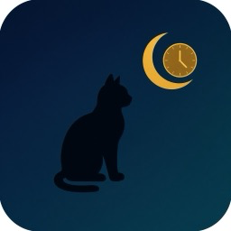
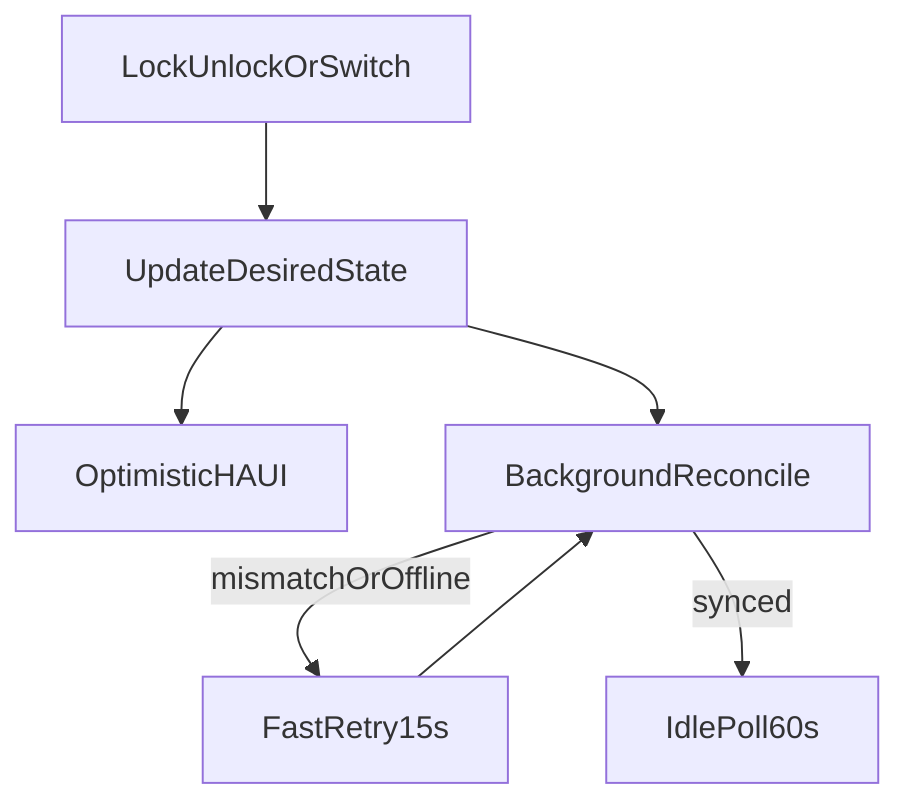

# SurePet Curfew



[](https://github.com/hacs/integration)
[](https://github.com/fyodorvi/ha-surepet-curfew/releases)

Home Assistant integration for **Sure Petcare Pet Door Connect (LCD)** curfew control.

**Supported:** Pet Door Connect (`product_id` 3) — the LCD pet door.

**Not supported:** Cat Flap Connect and other Sure Petcare devices. Non–Pet Door Connect devices are ignored.

## Features

- **Lock** entity with optimistic UI — updates instantly, then reconciles with the door in the background
- **Curfew** switch to enable or disable the schedule (persisted across restarts)
- **Lock time** and **Unlock time** entities — clock-picker tiles for your dashboard
- Timed unlock override during curfew (configurable duration)
- Fast retry polling while desired and observed state differ
- `sync_failed` attribute when reconciliation fails for 5+ minutes

## Installation

### HACS (recommended)

1. Open **HACS → Integrations → ⋮ → Custom repositories**
2. Add `https://github.com/fyodorvi/ha-surepet-curfew` as category **Integration**
3. Search for **SurePet Curfew**, download, and restart Home Assistant
4. Go to **Settings → Devices & Services → Add Integration** and add **SurePet Curfew**

### Manual

Copy `custom_components/surepet_curfew` into your Home Assistant config directory:

```
<config>/custom_components/surepet_curfew/
```

Restart Home Assistant, then add the integration from **Settings → Devices & Services**.

## Setup

1. Enter your Sure Petcare account **username** and **password**
2. One device is created per Pet Door Connect found in your account
3. Each door exposes four entities: lock, curfew switch, lock time, unlock time

### Changing settings

Open **Settings → Devices & Services → Integrations → SurePet Curfew**, select your entry, then use the **⋮** menu:

| Action | What it configures |
|--------|-------------------|
| **Configure** | Curfew override duration (minutes). Default: 30 |
| **Reconfigure** | Sure Petcare username and password |

**Lock time** and **Unlock time** are edited on the device entities themselves (not in Configure). Add them as clock-picker tiles on a room card. Defaults are **22:00** (lock) and **06:00** (unlock).

## Entities

| Entity | Type | Description |
|--------|------|-------------|
| Lock | `lock` | Effective door lock state (optimistic). Attributes: `observed_locked`, `sync_failed`, `pending_since` |
| Curfew | `switch` | Curfew schedule on/off (desired). Persisted per device across restarts. Attributes: `observed_curfew_enabled`, `sync_failed`, `pending_since` |
| Lock time | `time` | When the door locks each day (curfew start) |
| Unlock time | `time` | When the door unlocks each day (curfew end) |

## How it works

The integration maintains a **desired state** for each door and pushes it to the Sure Petcare API. The lock entity shows desired state immediately (optimistic UI). A background reconcile loop keeps the physical door in sync — important because the door can lose state (e.g. after a battery change) or go offline briefly.



- **Coordinator poll:** every 60 seconds when idle
- **Fast retry:** every 15 seconds while desired ≠ observed
- **Unavailable:** lock entity becomes unavailable after 5 minutes of failed reconcile (`sync_failed: true`)
- **Native curfew:** when the device is already in curfew mode with the right times, the integration does not re-send the schedule just because the API lock flag lags

### Curfew switch ON (default)

The native door curfew feature drives the schedule. Times use the door's timezone.

| Situation | What happens |
|-----------|--------------|
| Inside curfew window | Door should be **locked** |
| Outside curfew window | Door should be **unlocked** |
| Unlock **during** curfew | Timed override for `override_minutes` — curfew disabled on the device until the timer ends, then native curfew restored |
| Lock **during** an active override | Override cancelled; native curfew resumes immediately |
| Lock **outside** curfew | Door held locked until next lock time (`lock_until_curfew`), then native curfew restored |
| Unlock **outside** curfew | Hold cleared; door stays on native schedule (unlocked until lock time) |

### Curfew switch OFF

Fully manual mode. Lock and unlock commands apply directly; the schedule is not maintained. The on/off state is stored in config-entry options per device, so turning curfew off survives a Home Assistant restart.

### Time entities

Changing **Lock time** or **Unlock time**:

1. Updates in-memory settings for all doors on the account
2. Persists `curfew_start_time` / `curfew_end_time` to config-entry options
3. Reschedules transition timers
4. Pushes the new schedule to the Sure Petcare API in the background

### API

Uses [surepy](https://github.com/benleb/surepy) 0.9.0 for HTTP access. Curfew writes use a Pet Door–specific dict payload (not surepy's cat-flap `set_curfew` array helper).

## Development

### Local Home Assistant test bed

Requirements: Docker and Docker Compose.

```bash
docker compose up -d
```

Open [http://localhost:8123](http://localhost:8123), complete onboarding, then add **SurePet Curfew**.

The compose file bind-mounts `./custom_components` into the container. After code changes:

```bash
docker compose restart
```

Stop the test instance:

```bash
docker compose down
```

### Unit tests (no Home Assistant)

```bash
python3 -m venv .venv
source .venv/bin/activate
pip install -r requirements-dev.txt
pytest -m "not live"
```

### Live tests (real door)

Live tests call the Sure Petcare API and **move the physical door**. They snapshot state before running and restore it afterward, even on failure.

Create a `.credentials` file in the repo root (gitignored):

```
your@email.com
your-password
```

```bash
pytest -m live
```

### Project layout

```
custom_components/surepet_curfew/   # integration source
  api.py                            # surepy wrapper with retries
  controller.py                     # desired-state machine
  coordinator.py                    # HA data update coordinator
  lock.py / switch.py / time.py     # entity platforms
  schedule.py                       # curfew window helpers
  settings_store.py                 # persisted curfew on/off helpers
brand/                              # HACS repository icon
tests/                              # unit + live pytest suite
scripts/probe_api.py                # read-only API probe
ha-config/                          # local HA config (runtime state gitignored)
docker-compose.yml                  # local HA instance
```

## License

MIT — see [LICENSE](LICENSE).
